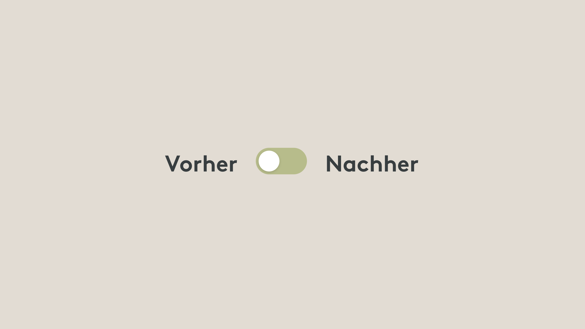
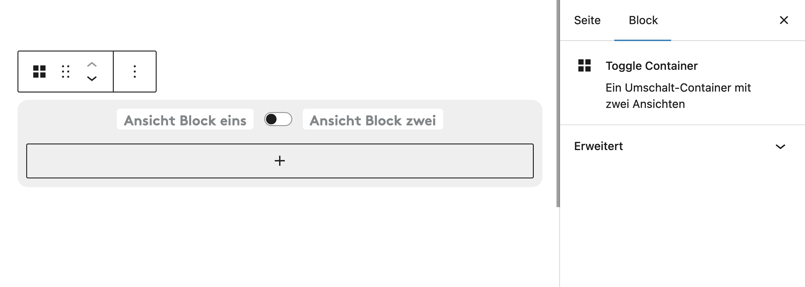

# UD Block: Toggle Container

Block zum Umschalten zwischen zwei Ansichten innerhalb desselben Inhaltsbereichs.
Jede Ansicht kann mit beliebigen Blöcken gefüllt werden. Der sichtbare Bereich wechselt per Klick auf die zugehörigen Schaltflächen.

## Funktionen

- **Zwei umschaltbare Ansichten**
  - Jede Ansicht enthält eigene Inhalte (z. B. Text, Bilder, Listen oder weitere Blöcke)
  - Standardmässig ist die erste Ansicht aktiv (`activeView: "one"`)
  - Umschalten erfolgt über die Beschriftungen `labelOne` und `labelTwo`

- **Flexible Inhaltsstruktur**
  - Unterstützt beliebige Gutenberg-Blöcke innerhalb beider Ansichten

## Screenshots

  
*Frontend-Darstellung mit Umschalt-Schaltflächen.*

  
*Block im Editor*

## Autor

[ulrich.digital gmbh](https://ulrich.digital)

## Lizenz

GPL v2 or later
[https://www.gnu.org/licenses/gpl-2.0.html](https://www.gnu.org/licenses/gpl-2.0.html)

